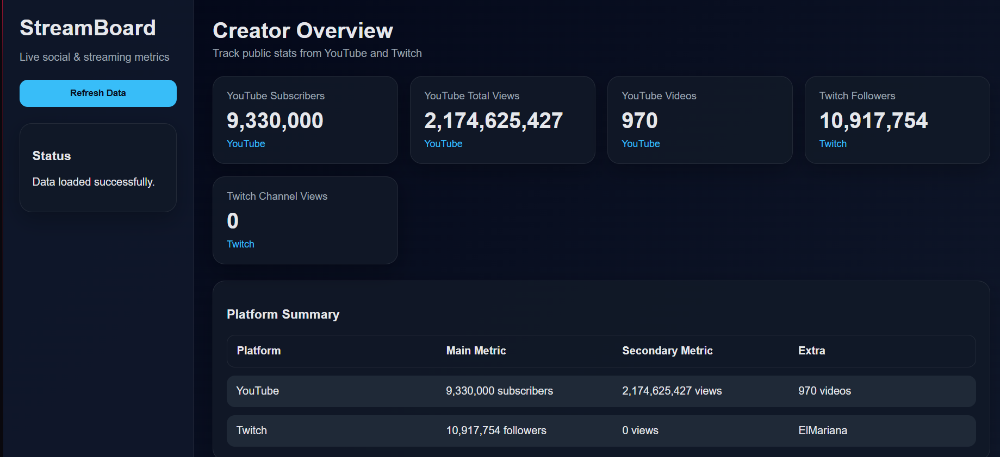

# Stream Stats Dashboard

A web dashboard that displays real-time streaming statistics from YouTube and Twitch.

---

## Preview



## Features

- YouTube:
  - Subscribers
  - Total Views
  - Video Count

- Twitch:
  - Followers
  - Channel Name

- Real-time API integration
- Clean and responsive UI
- Backend proxy for Twitch API

---

## Tech Stack

### Frontend
- HTML
- CSS
- JavaScript (Vanilla)

### Backend
- Node.js
- Express

### APIs
- YouTube Data API v3
- Twitch API (via proxy server)

---

## Project Structure

```bash
stream-stats-dashboard/
│
├── assets/
│   ├── css/
│   ├── js/
│   │   ├── api.js
│   │   ├── app.js
│   │   ├── config.js (ignored)
│   │   └── ui.js
│
├── data/
│   └── mock.json
│
├── server.js
├── package.json
├── .gitignore
└── README.md
```

## Setup
### 1. Clone the repository
git clone https://github.com/your-username/stream-stats-dashboard.git
cd stream-stats-dashboard
### 2. Install backend dependencies
npm install

### 3. Configure environment

Create the frontend config file:

```javascript
// assets/js/config.js
const CONFIG = {
  youtubeApiKey: "YOUR_YOUTUBE_API_KEY",
  youtubeChannelId: "YOUR_CHANNEL_ID",
  twitchProxyUrl: "http://localhost:3000/api/twitch-stats",
  useMockDataOnError: true
};
```
Create a .env file in the project root:

TWITCH_CLIENT_ID=your_twitch_client_id
TWITCH_CLIENT_SECRET=your_twitch_client_secret


### 4. Run backend
npm start
### 5. Run frontend
python -m http.server 5500

Open in browser:

http://localhost:5500

## Security Notes
API keys are not included in the repository
Twitch API is accessed through a backend proxy
Sensitive data should be stored using environment variables
## Future Improvements
Authentication system
Historical analytics
Multi-channel support
Deployment (Vercel / Render)

## Author

Johannes Guzman

## License

MIT License